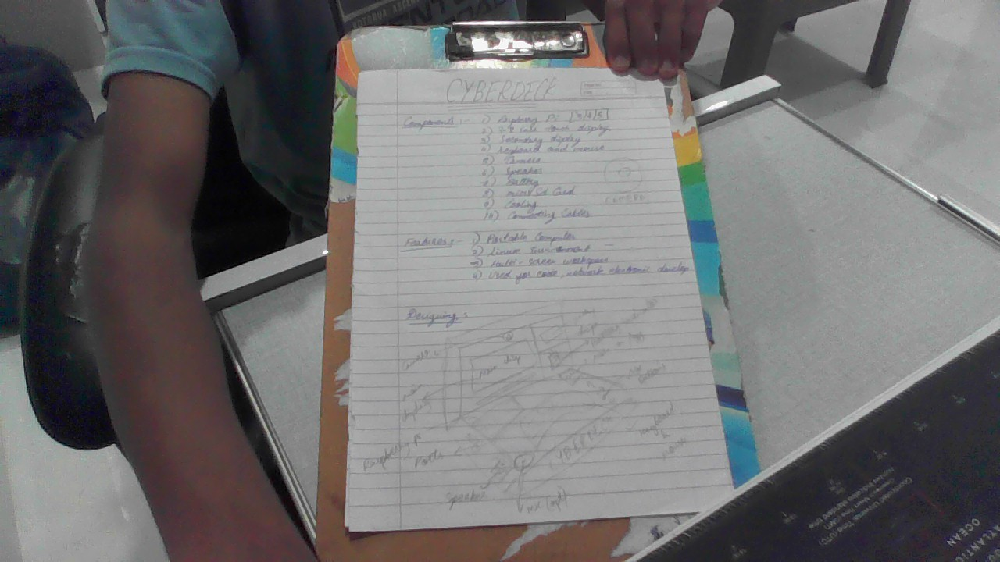

# Cyberdeck

Cyberdeck is a portable Raspberry Pi-based computer designed as a compact workstation for coding, electronics work and everyday experiments.

## Features

* Portable laptop-style design
* Main display with a secondary information display
* Portable coding and development workstation
* Battery-powered operation
* System status and battery monitoring
* Camera and audio support
* Compact input controls

## Hardware

The Cyberdeck will use a Raspberry Pi as the main computer, along with displays, keyboard and mouse, camera, speaker, battery/power system and other required electronics.

## Design

The Cyberdeck will use a laptop-style enclosure. The main 3.8-inch display will be placed in the upper section with the smaller display beside it. The keyboard, mouse and controls will be placed in the lower section.

The internal layout will be designed so the components are securely mounted inside the enclosure while keeping the device portable.

## Purpose

The goal is to build a compact personal computer that combines computing, displays, input devices and electronics into one portable device.

## Current Progress

The project is currently in the design and planning stage. The hardware layout and enclosure will be developed before the final build.

## Future Work

* Finalize the Raspberry Pi model
* Finalize the component list
* Design the enclosure
* Create the hardware design files
* Assemble and test the Cyberdeck
